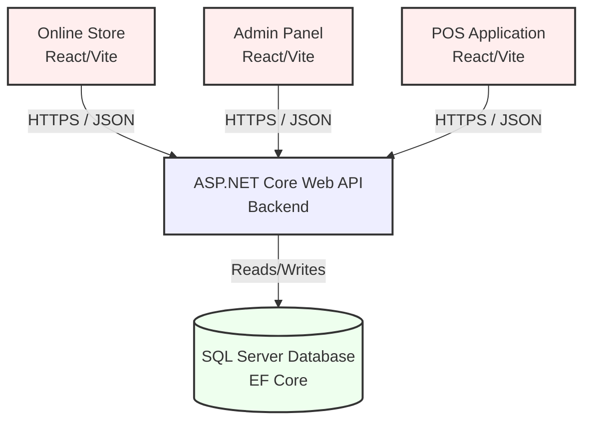
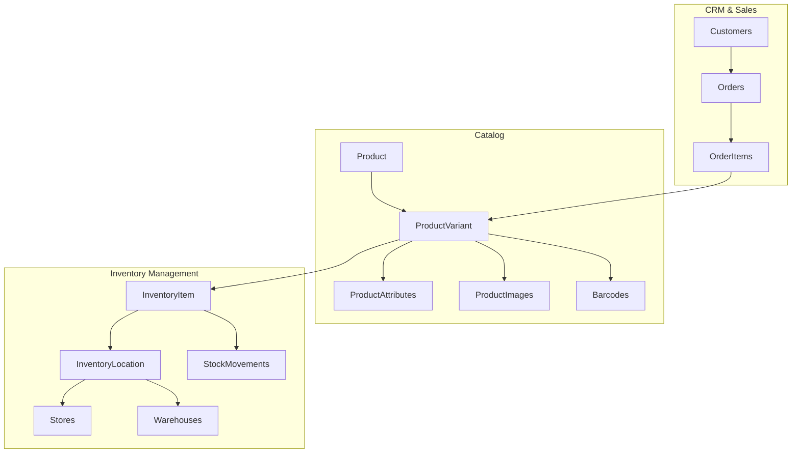
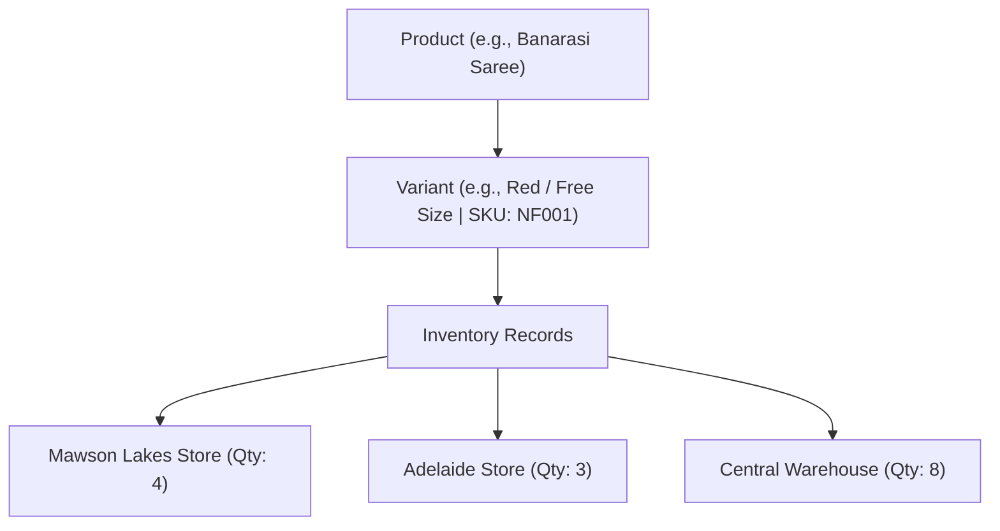
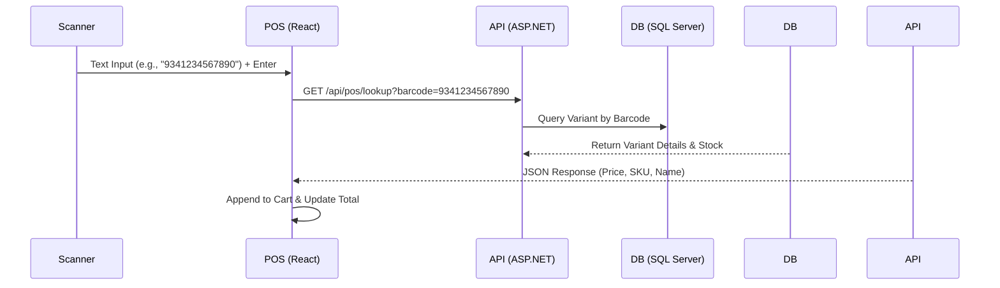
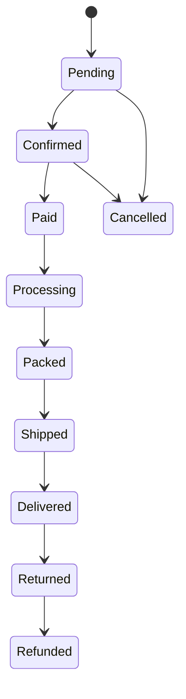
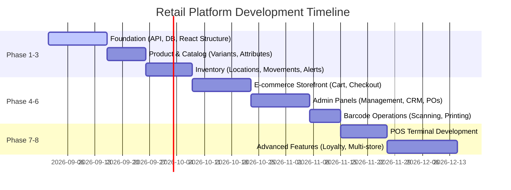

# Retail Management Platform & Online Store Specification

This document provides a structured specification for the design, architecture, and deployment roadmap of a unified retail management platform. The system is designed to act as the single source of truth for inventory, barcodes, customer records, and sales across an online storefront, admin panel, and future Point of Sale (POS) applications.

---

## 1. Architectural Philosophy

Instead of treating the online storefront, admin portal, and POS as disconnected systems with sync scripts, the platform utilizes a **single backend engine** that serves all interfaces.

### Key Principles
* **Business-Centric Database Design:** The schema is modeled around core business entities (Products, Inventory, Orders, CRM) rather than a specific UI.
* **Backend Enforcement:** Order state transitions, stock validations, and promotion rules are evaluated exclusively on the backend to prevent inconsistency.
* **Separation of Product & Inventory:** Products and variants do not hold quantities directly. Instead, quantities are tracked inside `InventoryItem` records tied to specific locations (Stores/Warehouses).

---

## 2. Technology Stack

| Component | Technology | Description |
| :--- | :--- | :--- |
| **Backend API** | ASP.NET Core Web API (C#) | Performs business logic, validation, authentication, and database transactions. |
| **ORM** | Entity Framework Core | Database access and schema migrations. |
| **Database** | SQL Server | Relational database handling all structured data. |
| **Authentication**| ASP.NET Core Identity + JWT | Token-based stateless authentication for all clients. |
| **Frontends** | React + TypeScript + Vite | Clean, fast SPA structure for Online Store, Admin, and POS. |
| **Styling** | MUI / Tailwind CSS | Component UI styling and responsive layouts. |
| **API Docs** | Swagger / OpenAPI | Auto-generated endpoint specs for frontend integration. |
| **Storage** | Local Storage (Initially) / AWS S3 or Azure Blob (Later) | Asset storage for product images. |
| **Barcodes** | Code128 / EAN-13 / QR Codes | Supporting both external/manufacturer and internally generated codes. |
| **CI/CD** | GitHub Actions or Azure DevOps | Deployment and automated test suites. |

---

## 3. Database Schema Blueprint

To ensure scalability (e.g., adding stores or tracking individual stock changes), the schema is structured into modular sections.

### 3.1 Schema Table Groups
* **Auth & Staff:** `Users`, `Roles`, `Permissions`, `Employees`, `AuditLogs`
* **CRM:** `Customers`, `CustomerAddresses`, `LoyaltyAccounts`, `LoyaltyTransactions`
* **Catalog:** `Products`, `ProductVariants`, `ProductImages`, `ProductAttributes`, `Categories`, `Subcategories`, `Brands`, `Collections`, `Barcodes`
* **Inventory:** `InventoryLocations` (Stores, Warehouses), `InventoryItem` (Stock mapping), `StockMovements` (Ledger), `StockAdjustments`, `StockTransfers`
* **Purchasing:** `Suppliers`, `PurchaseOrders`, `PurchaseOrderItems`
* **Sales & Ordering:** `Orders`, `OrderItems`, `Payments`, `Refunds`, `Returns`, `Carts`, `CartItems`, `Wishlists`, `WishlistItems`
* **Marketing:** `Coupons`, `Promotions`, `PromotionProducts`, `Reviews`

### 3.2 Product & Inventory Modeling
By decoupling variants from physical inventory, multi-store and warehouse support is inherent:

---

## 4. Key Workflows & Business Rules

### 4.1 Stock Control & Concurrent Sales
To prevent double-selling a product that is simultaneously ordered online and scanned at a POS cash register, stock is tracked with three states:
1. **Physical Quantity:** Total count physically present.
2. **Reserved Quantity:** Stock claimed by unfinished/pending online checkouts.
3. **Available Quantity:** Stock ready for purchase (`Available = Physical - Reserved`).

> [!IMPORTANT]
> The POS and online checkout process must query and decrement the **Available Quantity**. If available stock reaches 0, checkout is blocked.

### 4.2 Stock Movement Ledger (Audit Trail)
Direct manipulation of quantities is prohibited. Every change in stock must register a transaction in the `StockMovement` table.

$$\text{Current Stock} = \text{Opening Stock} + \text{Purchases} + \text{Returns} - \text{Sales} - \text{Damaged} \pm \text{Transfers}$$

* **Audit Entry:** Tracks `Who`, `What`, `When`, `BeforeValue`, `AfterValue`, `Reason` (e.g., "Damaged", "Sale", "Stock In").

### 4.3 POS Barcode Scanner Workflow
Most USB and Bluetooth scanners mimic keyboard input. The POS client intercepts the input:

### 4.4 Order Status State Machine
The backend strictly controls status updates. The frontend is not allowed to bypass status sequences.

---

## 5. System Features by Module

### Module 1: Online Store (Customer Facing)
* **Homepage:** Hero banners, collection shortcuts, new arrivals, best sellers, recently viewed products, newsletter signup.
* **Shopping Flow:** Category navigation, product search, cart, secure checkout.
* **Account Portal:** Order history, profile editing, shipping address book, wishlist, loyalty points balance.
* **Engagement:** Product reviews (submitted by verified buyers, approved by admins), coupon code redemption.

### Module 2: Admin Control Panel
* **Dashboard:** Real-time analytics charts (sales, orders, gross profit margins, low stock alerts, pending shipments).
* **Inventory Control:** Manual stock adjustments, inter-store transfers, suppliers dashboard, and Purchase Order (PO) workflows.
* **Auditing:** Complete view of database audit logs showing staff activity (e.g., price modifications, manual stock overrides).
* **Staff Access Control:** Role-based UI elements and API permissions (e.g., Cashiers cannot view profit margins or adjust cost prices).

### Module 3: Point of Sale (POS)
* **Fast UI:** Scanner-optimized keyboard shortcuts, minimal clicks to complete sales.
* **Core Sales Operations:** Add items, select customer, apply coupons, split payments (e.g., part cash, part card), hold/resume transactions.
* **Receipt Printing:** Thermal receipt formatting, invoice generation (A4), email receipts.

---

## 6. Phased Development Roadmap

To ensure a solid core architecture, the project is structured into 8 progressive development phases.

### Out of Scope for Version 1
To avoid scope creep, the following modules are deferred to future post-launch updates:
* ❌ AI-powered product recommendations and virtual AI try-ons.
* ❌ RFID tags and warehouse robotics/automation.
* ❌ Multi-country tax systems and manufacturing job cards.
* ❌ Native iOS/Android mobile apps.
